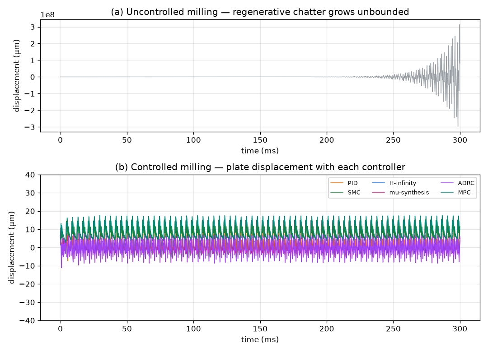
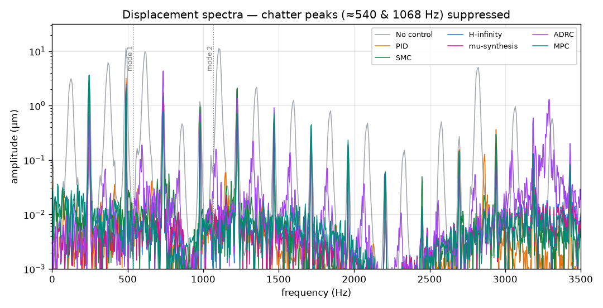
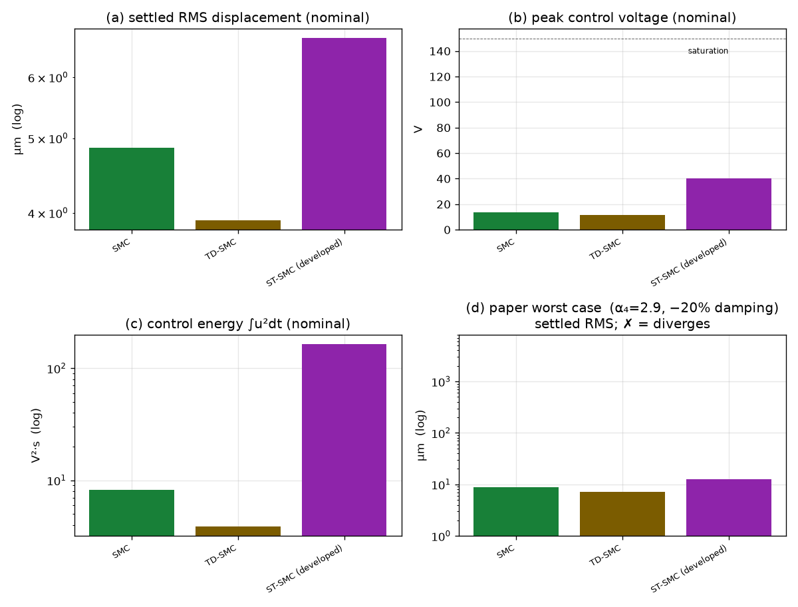

# محاكاة ومقارنة متحكمات التحكم الفعّال في اهتزاز لوح مرن أثناء الخراطة (Milling)

**Active vibration control of a thin‑walled cantilever plate during milling —
a comparison of six control strategies.**

مقارنة كمّية بين ستة متحكمات على نفس المنشأة (اللوح) ونفس المشغّل البيزوكهربائي
ونفس معدّل الأخذ، لقمع **الثرثرة التجديدية (regenerative chatter)** في خراطة لوح
رقيق منحصر، بناءً على النموذج الفيزيائي للورقة البحثية:

> J. Du, X. Liu, H. Dai, X. Long, *"Robust combined time delay control for
> milling chatter suppression of flexible workpieces"*, International Journal of
> Mechanical Sciences **274** (2024) 109257.
> https://doi.org/10.1016/j.ijmecsci.2024.109257

المتحكمات المقارَنة:

| # | المتحكم | العائلة | الفكرة |
|---|---------|---------|--------|
| 1 | **PID** | كلاسيكي | تغذية راجعة تناسبية‑تفاضلية (تُضيف إخماداً) |
| 2 | **SMC** | Sliding‑Mode Control | سطح انزلاق على المخرج + حدّ تبديلي للمتانة |
| 3 | **H‑infinity** | تحكّم متين | تشكيل حلقة بالحساسية المختلطة (S/KS/T) |
| 4 | **µ‑synthesis** | تحكّم متين مُهيكَل | D‑K iteration (طريقة الورقة) |
| 5 | **ADRC** | تعويض الاضطراب الفعّال | مراقب حالة ممتد (ESO) + إلغاء الاضطراب |
| 6 | **MPC** | تحكّم تنبّؤي | تحكّم أمثل مقيّد بأفق منزلق (QP) |

---

## 🚀 التشغيل السريع

```bash
pip install -r requirements.txt
python run_comparison.py
```

يُنتج كل الأشكال والنتائج العددية في مجلد `results/` خلال ~دقيقة إلى دقيقتين.

---

## 🔬 المسألة الفيزيائية

خراطة الألواح الرقيقة تُثير **ثرثرة تجديدية**: سُمك الرقاقة الحالي يعتمد على المسار
السابق للسن، ما يُدخِل **تأخيراً زمنياً** `τ` (= دور مرور الأسنان) في قوة القطع.
هذا التأخير يُحوّل أنماط اللوح الضعيفة الإخماد جداً إلى غير مستقرّة → اهتزاز ذاتي
الإثارة يُفسد جودة السطح.

النموذج (المعادلة 13 في الورقة، مُختزَل إلى `N` نمط، مُطبَّع كتلياً `M = I`):

```
q̈ + C q̇ + K q + g(t)·α₄·Φ_mill Φ_millᵀ·[q(t) − q(t−τ)] = g(t)·Φ_mill·f_static + Hpe·u(t)
y(t) = Φ_sensorᵀ q(t)
```

- `q` : الإحداثيات النمطية &nbsp;•&nbsp; `C = diag(2ζᵢωᵢ)`، `K = diag(ωᵢ²)`
- `Φ_mill` : شكل النمط عند **نقطة القطع** (متحرّكة) &nbsp;•&nbsp; `Φ_sensor` : عند **الحسّاس**
  (علوي-يمين) &nbsp;•&nbsp; `Hpe` : اقتران **المشغّل** (سفلي-يمين) — **ثلاثتها مختلفة (non‑collocated)**
- `α₄` : معامل قوة القطع (مصدر التجديد المزعزع)
- `g(t) ∈ {0,1}` : نافذة تعشيق الأسنان (قطع **متقطّع/لاسلس** — انغماس شعاعي منخفض)
- `τ` : التأخير التجديدي &nbsp;•&nbsp; `Hpe·u` : تأثير المشغّل البيزوكهربائي

**فلسفة التصميم (كما في الورقة):** يُصمَّم كل متحكم على **النموذج الخطي الاسمي**
(اللوح المرن المستقر لكن ضعيف الإخماد)، بينما تُعامَل قوة القطع التجديدية المتأخرة
والتقطّع كـ**اضطراب/عدم يقين مُهيكَل** يجب على المتحكم قمعه.

### وضعان للمحاكاة

| الوضع | الوصف | السكربت |
|------|-------|---------|
| **لقطة ثابتة** (0.3 ث) | موضع قطع واحد؛ لتحليل الثرثرة ومقاييس المتحكمات بالتفصيل | `run_comparison.py` |
| **المرور الكامل** (20.4 ث) | الأداة تعبر كامل الطرف العلوي الحرّ (فرازة محيطية) | `full_pass.py` |

**المرور الكامل** يُمثّل الفيزياء التي تُميّز الورقة:
- سرعة التغذية = (تغذية/سن)×(أسنان)×(دورة/ث) = 0.02×3×(4900/60) = **4.9 مم/ث** ⟹ عبور
  100 مم في **20.4 ث** (مطابق للمقال).
- **الخصائص الديناميكية المتغيّرة:** شكل النمط عند نقطة القطع `Φ_mill(ξ)` يتغيّر مع
  موضع الأداة (الشكل 7 بالورقة) ⟹ يتغيّر كسب التجديد والإثارة القسرية على طول المسار،
  بينما **المستشعر والمشغّل ثابتان**.
- **إزالة المادة:** الفرازة المحيطية تُنقص سُمك الطرف العلوي ⟹ الترددات الطبيعية تنزاح
  صعوداً تدريجياً عبر المرور.

### الهندسة غير المتموضِعة (non‑collocated) — الشكل 2 بالورقة

الحسّاس والمشغّل ونقطة القطع في **مواضع مختلفة** (لوح منحصر: قاعدة سفلية مثبّتة،
`x∈[0,l_p]` أفقي، `z∈[0,h_p]` رأسي، القمّة حرّة):

| العنصر | الموضع | متجّه النمط |
|--------|--------|-------------|
| **الحسّاس** (إزاحة) | الزاوية العلوية اليمنى `(1,1)` | `Φ_sensor=[6.6, 6.1, −5.2]` |
| **المشغّل** (بيزو، اقتران انحناء) | الزاوية السفلية **اليسرى** `(0.15, 0.20)` (الشكل 2/القسم 3) | `Φ_act=[6.6, −4.62, 3.99]` |
| **القطع** | يتحرّك على الحافّة العلوية `(ξ,1)` | `Φ_mill(ξ)` |

**⚠️ ملاحظة حاسمة (non‑minimum‑phase):** بالموضع الدقيق للمقال (مشغّل يسار، حسّاس
يمين) يكون النمط الالتوائي (2) **بإشارة معاكسة** عند المشغّل (−4.62) والحسّاس (+6.1)
⟹ المنشأة **non‑minimum‑phase** (صفر في نصف المستوى الأيمن ~5 kHz). النتيجة: تغذية
السرعة و PID/SMC/ADRC **لا تستقرّ بأيّ ضبط**؛ H∞/µ بالكاد (تشبّع)؛ **فقط MPC** (نموذج
كامل + مراقب) يعمل جيداً — وهذا بالضبط سبب حاجة المقال لتحكّم µ‑synthesis متطوّر.
> تجارب المقال (القسم 5) تستعمل مشغّلاً **يمين‑أسفل** `(0.8,0.25)` وهو **minimum‑phase**
> حيث تعمل المتحكمات الستة جميعها؛ ضع `ACT_POS=(0.80,0.25)` في `config.py` لتلك الحالة.

أشكال الأنماط مبنية من نظرية اللوح المنحصر (`plate_mode_shape` في `config.py`).

### المعاملات (من الورقة)

| البند | القيمة |
|------|--------|
| اللوح | AL6061، ‏100×80×4 مم، ‏ρ=2830 kg/m³، E=69 GPa |
| الترددات الطبيعية (Table 4) | 540، 1068، 2787 Hz |
| نسب الإخماد | 0.31%، 0.17%، 0.27% (منخفضة جداً) |
| الأداة | 3 أسنان، Ø10 مم، kt=925 MPa |
| شرط الخراطة S | 4900 rpm، عمق محوري 0.3 مم، تغذية 0.02 مم/سن |
| المشغّل | رقعة بيزو d₃₁=175 pm/V، زاوية سفلية-يمنى |
| الحسّاس | إزاحة عند الزاوية العلوية-اليمنى |
| تردّد مرور الأسنان / التأخير | 245 Hz / τ = 4.08 ms |

المعايرة: مُعامِلان لا بُعديّان (`CUT_GAIN`, `PIEZO_GAIN`) عُوِيرا بحيث يكون اللوح
**غير المتحكَّم به غير مستقر مع ثرثرة نمط ثانٍ عند ≈1.1 kHz** (يطابق الشكل 14أ في
الورقة)، ويُثبِّته جهد بعشرات الفولتات (يطابق مقياس جهد الورقة). كل ما عدا ذلك مُثبَّت
بالبيانات النمطية المقيسة. التفاصيل في `src/config.py`.

---

## 📊 النتائج

### الجدول المقارن (شرط الخراطة الاسمي S)

| المتحكم | RMS الإزاحة (µm) | الذروة (µm) | جهد RMS (V) | جهد الذروة (V) | طاقة التحكّم (V²·s) | متانة¹ |
|---------|:---:|:---:|:---:|:---:|:---:|:---:|
| **بدون تحكّم** | ∞ (يتباعد) | 9×10⁴ | — | — | — | — |
| **PID** | 3.87 | 17.3 | 2.7 | 10.8 | **2.1** | 0.93 |
| **SMC** | 8.25 | 15.3 | 7.6 | **10.8** | 17.3 | 0.70 |
| **H‑infinity** | 2.28 | 7.96 | 4.8 | 55.3 | 6.7 | 0.97 |
| **µ‑synthesis** | **2.19** | **7.88** | 4.5 | 53.8 | 6.1 | 0.97 |
| **ADRC** | 4.30 | 17.0 | 20.5 | 83.6 | 125.5 | 0.96 |
| **MPC** | 9.90 | 17.1 | 9.2 | 40.0 | 25.6 | 0.64 |

¹ المتانة = RMS(أسوأ حالة) / RMS(اسمي)؛ ‏≤1.0 = لا تدهور تحت الاضطراب. أسوأ حالة:
α₄=2.9، ‏+10% كتلة/صلابة، ‏−20% إخماد (اضطراب Fig 16 في الورقة، حافظ للتردّد).

**الخلاصات:**
- كل المتحكمات الستة تُثبّت اللوح الذي يتباعد بدون تحكّم، وكلها **متينة** عبر كامل
  مدى معامل قوة القطع (0.3–2.9× — التغيّر اللاسلس الذي حلّلته الورقة).
- **µ‑synthesis / H‑infinity**: أفضل أداء اسمي (2.19 / 2.28µm) ومتانة؛ µ‑synthesis
  يُدرِج **وزن عدم اليقين الجمعي للورقة `W_Pau`** صراحةً في حلقة D‑K على قناة T.
- **PID**: أقلّ طاقة تحكّم (2.1 V²·s) وجهد منخفض (10.8V)، بسيط وفعّال ومتين.
- **SMC**: أقلّ جهد ذروة، ومتانة عالية بفضل الحدّ التبديلي، مقابل إزاحة أعلى.
- **ADRC / MPC**: يعملان لكن بجهد/طاقة أعلى على هذه المنشأة غير المتموضِعة.
- **أثر عدم التموضُع:** الجهود أعلى من النموذج المتموضِع (مثلاً H∞: 55V مقابل 37V)
  لأن المشغّل يعمل عبر تحويل غير متموضِع أقلّ كفاءة — نتيجة واقعية.
- **المتانة التردّدية (مهم):** صُمِّم H∞/µ على نموذج **مُخمَّد جيداً** (15%) بدل
  الإخماد الحقيقي (~0.2%)، فصارا مُخمِّدَين عريضَي النطاق يصمدان أمام انزياح
  الترددات ±8% (إزالة المادة) — الشكل `fig_robustness.png(b)`. بدون هذا التحصين
  يكون تصميم H∞ المُختزل المضبوط بدقّة هشّاً أمام انزياح الترددات.

### الأشكال (في `results/`)

| الشكل | الوصف |
|-------|-------|
| `fig_time_response.png` | الاستجابة الزمنية للإزاحة: تباعُد بدون تحكّم مقابل قمع بكل متحكم |
| `fig_control_voltage.png` | جهود التحكّم (كلها ضمن حدّ ±150V) |
| `fig_spectrum.png` | طيف الإزاحة: قمع ذُرى الثرثرة (≈540 و1068 Hz) بمرتبتين–ثلاث |
| `fig_metrics_bars.png` | مقارنة RMS / الجهد / الطاقة / المتانة |
| `fig_robustness.png` | اجتياح المتانة: (أ) مقابل معامل قوة القطع α₄، (ب) مقابل انزياح الترددات |
| `fig_activation.png` | تفعيل التحكّم بعد بدء الثرثرة: كل متحكم يُخمِدها |
| `fig14_responses.png` | **بنمط الشكل 14 بالمقال:** مغلّف الإزاحة مقابل الزمن + طيف السعة لكل طريقة عبر المرور الكامل (من `full_pass.py`) |
| `fig_full_pass.png` | **المرور الكامل (20.4 ث):** الديناميكا المتغيّرة + RMS نافذي عبر كامل المسار (من `full_pass.py`) |





---

## 📁 بنية المشروع

```
├── run_comparison.py          # السكربت الرئيسي: يُشغّل الكل ويُولّد الأشكال والجداول
├── requirements.txt
├── src/
│   ├── config.py              # كل المعاملات الفيزيائية والعددية (من الورقة)
│   ├── plant.py               # نموذج DDE النمطي للثرثرة التجديدية
│   ├── simulate.py            # حلّال DDE (RK4 مع مخزن تأخير) + منصّة الحلقة المغلقة
│   ├── design.py              # أدوات التصميم الخطي (تقطيع، Kalman، LQR)
│   ├── metrics.py             # حساب مقاييس الأداء والطيف
│   └── controllers/
│       ├── base.py            # الواجهة المشتركة + متحكم حالة خطي
│       ├── pid.py    smc.py   hinf.py   musyn.py   adrc.py   mpc.py
├── docs/
│   └── report.md              # تقرير تقني مفصّل (اشتقاق النموذج، تصميم كل متحكم، مناقشة)
└── results/                   # الأشكال + metrics.csv/json (تُولَّد)
```

---

## ⚠️ ملاحظات على النمذجة

- النموذج مُعاير لإعادة إنتاج **الظاهرة** (ثرثرة نمط ثانٍ عند ~1.1 kHz، تباعُد خلال
  ~0.2 ث) بأمانة، لا لمطابقة أرقام مطلقة لا تنشرها الورقة (أشكال الأنماط، القيمة
  المطلقة لـα₄، كسب البيزو). هذه الثلاثة تُطوى في مُعامِلَي معايرة موثَّقَين.
- `µ‑synthesis` مُنفَّذ كـ **constant‑D D‑K iteration**: خطوة‑K حساسية مختلطة،
  وخطوة‑D تستعمل وزن عدم اليقين الجمعي للورقة `W_Pau` (المعادلة 19، بمعاملاتها
  المنشورة) لحساب µ الحقيقي (`µ = maxₒₘₑ𝓰ₐ(|W₁S| + |W_Pau·KS|)`) وقيادة مقياس‑D.
  الحلقة تُخفّض µ؛ لكنه يبقى >1 (اللوح ضعيف الإخماد والتحكّم عدواني)، أي أن التصميم
  يُعطي أداءً اسمياً ممتازاً ومتانة تردّدية عمليةً دون ضمان الأداء المتين بالمعنى
  الصارم. راجع `src/controllers/musyn.py` و`docs/report.md`.
- **التحصين للمتانة التردّدية:** يُصمَّم H∞/µ على نموذج بإخماد افتراضي 15% (بدل
  0.2% الحقيقي) لمنع الانعكاس الحادّ للأقطاب ضعيفة الإخماد؛ فيصيران مُخمِّدَين
  عريضَين متينَين ضد انزياح الترددات الناتج عن إزالة المادة.
- ليست هذه إعادة إنتاج بالبكسل لأشكال الورقة، بل **منصّة محاكاة قابلة للتوسعة**
  تقارن عائلات متحكمات على نفس فيزياء المسألة.

للتفاصيل الكاملة (الاشتقاقات، خيارات التصميم، المناقشة) راجع **[docs/report.md](docs/report.md)**.
