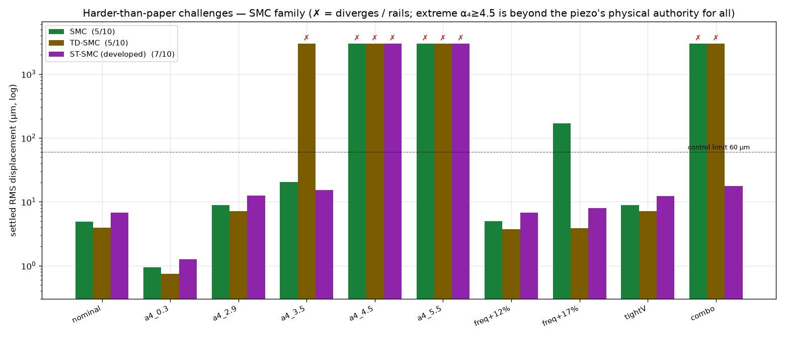

# محاكاة ومقارنة متحكمات الانزلاق (Sliding-Mode) للتحكم الفعّال في اهتزاز لوح مرن أثناء الخراطة (Milling)

**Active vibration control of a thin‑walled cantilever plate during milling —
developing the sliding‑mode family from SMC → TD‑SMC → ST‑SMC toward a harder
control envelope.**

مقارنة كمّية بين **ثلاثة متحكمات من عائلة الانزلاق** على نفس المنشأة (اللوح) ونفس
المشغّل البيزوكهربائي ونفس معدّل الأخذ، لقمع **الثرثرة التجديدية (regenerative
chatter)** في خراطة لوح رقيق منحصر، بناءً على النموذج الفيزيائي للورقة البحثية:

> J. Du, X. Liu, H. Dai, X. Long, *"Robust combined time delay control for
> milling chatter suppression of flexible workpieces"*, International Journal of
> Mechanical Sciences **274** (2024) 109257.
> https://doi.org/10.1016/j.ijmecsci.2024.109257

المتحكمات الثلاثة (مسار تطوير واحد):

| # | المتحكم | العائلة | الفكرة | جديد؟ |
|---|---------|---------|--------|:---:|
| 1 | **SMC** | Sliding‑Mode Control | سطح انزلاق **حالة** (صيغة نظامية) + مراقب Kalman + حدّ تبديلي (طبقة حدّية)، مضبوط بـPSO | قاعدة |
| 2 | **TD‑SMC** | انزلاقي + تأخير زمني | SMC ذو تغذية الحالة + حدّ تأخير زمني `K_Pp·y(t−τ)+K_Pd·ẏ(t−τ)` (فكرة معادلة 30) | **لا** |
| 3 | **ST‑SMC** ⭐ | **المتحكّم المطوَّر** | Super‑Twisting (انزلاق من الرتبة الثانية، مستمرّ) `−k₁√\|s\|·sign(s) − kₗ·s + w` + **تغذية أمامية للقوة التجديدية** تُلغيها عند منبعها | تطوير هندسيّ |

> **صدق علميّ — لا ادّعاء بالجِدّة:** كلّ من TD‑SMC وST‑SMC **ليس قانون تحكّم جديداً**.
> جمعُ الانزلاق مع تعويض التأخير الزمني، وخوارزمية Super‑Twisting، وتعويض القوة
> المتأخّرة — كلّها مفاهيم **مُؤسَّسة**. المساهمة هنا **هندسية**: تركيبها للمسألة
> اللاسلسة اللاطورية (non‑minimum‑phase) للخراطة وضبطها لبلوغ **مِظروف تحكّم أصعب من
> الورقة**. TD‑SMC مرجعٌ مضبوط قويّ يجب على ST‑SMC أن يتجاوزه على تحديات حقيقية أصعب،
> وليس متحكّماً مُدّعى أنه جديد.

> **نموذج الفرازة = نموذج المقال حرفياً:** المنشأة المُحاكاة تستعمل معاملات قوة القطع
> **اللاسلسة المتغيّرة بالزمن** `α₃(t), α₄(t)` بصيغة المقال (المعادلات 2–4: تكاملات
> التعشيق لكل سنّ مع زاوية الحلزون) لا نافذةَ تعشيق مثالية — `src/cutforce.py`.

---

## 🎯 لماذا تطوير TD‑SMC؟ (السرد)

الورقة تدرس قوة القطع حتى `α₄≈2.9×` وانزياح تردّد معتدلاً. **TD‑SMC مرجعٌ ممتاز في
هذا النطاق** (اسمي 3.9µm بـ11V فقط، والأنعم على محور التردّد). لكن حين نُشدّد الظروف
إلى ما بعد الورقة، تنكشف **حدوده على محور القوة**: يتباعد عند `α₄=3.5×`، وينهار عند
الحالة المركّبة (`α₄=4.0×` + إخماد −40%). كذلك SMC البسيط قويّ على محور القوة لكنه
**ينفجر (167µm) عند رفع التردّد +17%**.

**الفكرة:** نأخذ أقوى قاعدة (تغذية الحالة الانزلاقية) ونطوّرها بعنصرين:

1. **Super‑Twisting** (انزلاق من الرتبة الثانية) بدل حدّ الوصول ذي الطبقة الحدّية —
   قانونٌ **مستمرّ** (لا قرقعة يعجز البيزو عن ملاحقتها) بتقارب زمن‑منتهٍ ودقّة انزلاق
   أعلى، مع حدّ خطّي `−kₗ·s` للإخماد.
2. **تغذية أمامية مبنيّة على النموذج للقوة التجديدية**: مخزن تأخير `τ` + حالة المراقب
   يُعيدان بناء الإثارة القطعية المتأخّرة، فتُلغى **إسقاطُها على متغيّر الانزلاق `s`
   عند منبعه**، ما يُفرِغ حدَّ الوصول حيث تُولَد الثرثرة — وهذا ما يدفع سقف قوة القطع
   نحو **الحدّ الفيزيائي للمشغّل**.

الكسب مضبوط على **جناح تحديات أصعب من الورقة** (`src/challenges.py`): قوّة قطع متطرّفة
`α₄` حتى ~4×، رفع تردّد كبير +17%، حدّ مشغّل ضيّق 20V، وحالة مركّبة متطرّفة.

النتيجة: **ST‑SMC هو الوحيد المتين على المحورين معاً** (القوة **و** التردّد)، والوحيد
الذي يصمد أمام الحالة المركّبة التي تُسقِط SMC **و** TD‑SMC.

---

## 🚀 التشغيل السريع

```bash
pip install -r requirements.txt
python run_comparison.py       # المقارنة الثلاثية (اسمي + أسوأ حالة) + الأشكال والجداول
python make_challenge_figure.py # جناح التحديات الأصعب من الورقة (الشكل المِحوري)
python full_pass.py            # المرور الكامل 20.4 ث للثلاثة (اختياري)
```

يُنتج `run_comparison.py` كل أشكال اللقطة الاسمية في `results/`، بينما
`make_challenge_figure.py` يُنتج `results/fig_challenges.png` — الأداء عبر العشرة
تحديات الأصعب. كسب المتحكمات مضبوط سلفاً (قِيَمه في الكود).

---

## 🔬 المسألة الفيزيائية

خراطة الألواح الرقيقة تُثير **ثرثرة تجديدية**: سُمك الرقاقة الحالي يعتمد على المسار
السابق للسن، ما يُدخِل **تأخيراً زمنياً** `τ` (= دور مرور الأسنان) في قوة القطع.
هذا التأخير يُحوّل أنماط اللوح الضعيفة الإخماد جداً إلى غير مستقرّة → اهتزاز ذاتي
الإثارة يُفسد جودة السطح.

النموذج (المعادلة 12 في الورقة، مُختزَل إلى `N` نمط، مُطبَّع كتلياً `M = I`):

```
q̈ + C q̇ + K q + α₄(t)·Φ_mill Φ_millᵀ·[q(t) − q(t−τ)] = fτ·α₃(t)·Φ_mill + Hpe·u(t)
y(t) = Φ_sensorᵀ q(t)
```

- `q` : الإحداثيات النمطية &nbsp;•&nbsp; `C = diag(2ζᵢωᵢ)`، `K = diag(ωᵢ²)`
- `Φ_mill` : شكل النمط عند **نقطة القطع** (متحرّكة) &nbsp;•&nbsp; `Φ_sensor` : عند **الحسّاس**
  (علوي-يمين) &nbsp;•&nbsp; `Hpe` : اقتران **المشغّل** (سفلي-يسار) — **ثلاثتها مختلفة (non‑collocated)**
- `α₃(t), α₄(t)` : معاملا قوة القطع **اللاسلسان** بصيغة المقال الحرفية (المعادلات 2–4)
- `τ` : التأخير التجديدي &nbsp;•&nbsp; `Hpe·u` : تأثير المشغّل البيزوكهربائي

**فلسفة التصميم (كما في الورقة):** يُصمَّم كل متحكم على **النموذج الخطي الاسمي**
(اللوح المرن المستقر لكن ضعيف الإخماد)، بينما تُعامَل قوة القطع التجديدية المتأخرة
والتقطّع كـ**اضطراب/عدم يقين مُهيكَل** يجب على المتحكم قمعه.

### وضعان للمحاكاة

| الوضع | الوصف | السكربت |
|------|-------|---------|
| **لقطة ثابتة** (0.3–0.35 ث) | موضع قطع واحد؛ لتحليل الثرثرة ومقاييس المتحكمات بالتفصيل | `run_comparison.py`, `make_challenge_figure.py` |
| **المرور الكامل** (20.4 ث) | الأداة تعبر كامل الطرف العلوي الحرّ (فرازة محيطية) | `full_pass.py` |

**المرور الكامل** يُمثّل الفيزياء التي تُميّز الورقة: شكل النمط عند نقطة القطع
`Φ_mill(ξ)` يتغيّر مع موضع الأداة (الخصائص الديناميكية المتغيّرة)، والترددات الطبيعية
تنزاح صعوداً تدريجياً بإزالة المادة، بينما **المستشعر والمشغّل ثابتان**.

### الهندسة غير المتموضِعة (non‑collocated) — الشكل 2 بالورقة

الحسّاس والمشغّل ونقطة القطع في **مواضع مختلفة** (لوح منحصر: قاعدة سفلية مثبّتة،
القمّة حرّة):

| العنصر | الموضع | متجّه النمط |
|--------|--------|-------------|
| **الحسّاس** (إزاحة) | الزاوية العلوية اليمنى `(1,1)` | `Φ_sensor=[6.6, 6.1, −5.2]` |
| **المشغّل** (بيزو، اقتران انحناء) | الزاوية السفلية **اليسرى** `(0.15, 0.20)` | `Φ_act=[6.6, −4.62, 3.99]` |
| **القطع** | يتحرّك على الحافّة العلوية `(ξ,1)` | `Φ_mill(ξ)` |

**⚠️ ملاحظة حاسمة (non‑minimum‑phase):** بالموضع الدقيق للمقال (مشغّل يسار، حسّاس
يمين) يكون النمط الالتوائي (2) **بإشارة معاكسة** عند المشغّل (−4.62) والحسّاس (+6.1)
⟹ المنشأة **non‑minimum‑phase** (صفر في نصف المستوى الأيمن ~5175 Hz، فوق الأنماط
المتحكَّم بها). هذه الهندسة الأصعب — التي صُمِّم لأجلها متحكّم المقال المتين — تُفسِّر
**لماذا تغذية الحالة الانزلاقية هي أقوى قاعدة هنا**: تغذية المخرج مُقيَّدة بحدّ الأداء
اللاطوري (waterbed) والصفر اليمنى، بينما تغذية الحالة ليست كذلك، فتُضبَط لتغطية النطاق.

### المعاملات (من الورقة)

| البند | القيمة |
|------|--------|
| اللوح | AL6061، ‏100×80×4 مم، ‏ρ=2830 kg/m³، E=69 GPa |
| الترددات الطبيعية (Table 4) | 540، 1068، 2787 Hz |
| نسب الإخماد | 0.31%، 0.17%، 0.27% (منخفضة جداً) |
| الأداة | 3 أسنان، Ø10 مم، kt=925 MPa |
| شرط الخراطة S | 4900 rpm، عمق محوري 0.3 مم، تغذية 0.02 مم/سن |
| المشغّل | رقعة بيزو d₃₁=175 pm/V، زاوية سفلية-**يسرى** (الشكل 2 بالمقال) |
| الحسّاس | إزاحة عند الزاوية العلوية-اليمنى |
| تردّد مرور الأسنان / التأخير | 245 Hz / τ = 4.08 ms |

---

## 📊 النتائج

### 1) اللقطة الاسمية وأسوأ حالة الورقة (من `run_comparison.py`)

| المتحكم | RMS اسمي (µm) | ذروة‑V | طاقة (V²·s) | أسوأ `α₄=2.9` (−20% إخماد) |
|---------|:---:|:---:|:---:|:---:|
| **SMC** | 4.86 | 13.5 | 8.19 | 8.80µm |
| **TD‑SMC** | **3.91** | **11.4** | **3.85** | 7.27µm |
| **ST‑SMC (المطوَّر)** ⭐ | 6.75 | 40.4 | 164.2 | 12.44µm |

> **مقايضة أمينة:** في الظروف **السهلة** (اسمي/الورقة) يبقى TD‑SMC الأنعم والأدقّ
> (3.9µm/11V). ST‑SMC يدفع جهداً أعلى (~40V) لأن Super‑Twisting أكثر عدوانية —
> يستردّ هذا الثمن في **الطرف الصعب** حيث ينفرد بالبقاء. لا تستعمل ST‑SMC للقطع
> السهل؛ قيمتُه في اتّساع المِظروف.

### 2) جناح التحديات الأصعب من الورقة (من `make_challenge_figure.py`)

RMS مستقرّة (µm) / ذروة الجهد (V). **DIVERGES** = يتباعد/غير مستقر. العتبة: RMS < 60µm
وبلا تشبّع دائم.

| التحدّي | SMC | TD‑SMC | ST‑SMC (المطوَّر) |
|--------|:---:|:---:|:---:|
| اسمي | 4.9 / 14 | 3.9 / 11 | 6.8 / 40 |
| `α₄=0.3×` (قوة منخفضة) | 0.9 / 12 | 0.7 / 5 | 1.3 / 40 |
| `α₄=2.9×` (أقصى الورقة) | 8.8 / 23 | 7.2 / 24 | 12.5 / 51 |
| **`α₄=3.5×`** (بعد الورقة) | 20.2 / 83 | ❌ **DIVERGES** | ✅ **15.1 / 57** |
| `α₄=4.5×` (فوق الحدّ الفيزيائي)¹ | ❌ DIVERGES | ❌ DIVERGES | ❌ DIVERGES |
| `α₄=5.5×` (فوق الحدّ الفيزيائي)¹ | ❌ DIVERGES | ❌ DIVERGES | ❌ DIVERGES |
| رفع تردّد +12% | 4.9 / 16 | 3.7 / 16 | 6.8 / 43 |
| **رفع تردّد +17%** | ❌ **167 / تشبّع** | 3.9 / 21 | ✅ **7.9 / 47** |
| حدّ مشغّل ضيّق 20V² | 8.8 / تشبّع | 7.1 / تشبّع | 12.4 / تشبّع |
| **مركّبة (`α₄=4.0×` + إخماد −40%)** | ❌ **DIVERGES** | ❌ **DIVERGES** | ✅ **17.6 / 64** |
| **الصامدون** | **5 / 10** | **5 / 10** | **7 / 10** ⭐ |

¹ `α₄≥4.5×` **يتجاوز سلطة المشغّل البيزو الفيزيائية** فيُسقِط **كلّ** المتحكمات — يُبقى
كعلامة سقف أمينة، لا كإخفاق ضبط. ² عند 20V فقط لا يستطيع أيّ متحكّم قمع `α₄=2.9×` دون
تشبّع الحدّ (يحتاج ~24V)، فيبقى الثلاثة مستقرّين لكن على الحدّ.

**الخلاصات:**
- **ST‑SMC ينفرد بالبقاء على المحورين معاً:** يصمد عند `α₄=3.5×` (حيث يتباعد TD‑SMC)
  **و** عند +17% تردّد (حيث ينفجر SMC إلى 167µm) — لا أحد غيره ينجح في الاثنين.
- **الحالة المركّبة هي الحاسمة:** `α₄=4.0×` مع إخماد −40% تُسقِط SMC **و** TD‑SMC
  معاً، بينما يُثبّتها ST‑SMC عند 17.6µm — وهذا هو "التحدّي التحكميّ الأكبر" المقصود.
- **TD‑SMC ليس متجاوَزاً كلّياً:** يبقى الأنعم والأفضل على **محور التردّد** (+17% بـ
  3.9µm/21V) وفي الظروف السهلة — فهو مرجعٌ قويّ لا قشّة.
- **السقف الفيزيائيّ حقيقيّ:** `α₄≥4.5×` مستحيل للجميع؛ لا يُخفيه أيّ ضبط — تُبيّنه
  التغذيةُ الأمامية الدقيقة التي تدفع ST‑SMC إلى ~4× ثمّ يتوقّف عند حدّ البيزو.

### الأشكال (في `results/`)

| الشكل | الوصف |
|-------|-------|
| **`fig_challenges.png`** | **الشكل المِحوري:** أعمدة لوغاريتمية لـRMS عبر العشرة تحديات، ✗ للتباعد/التشبّع، عدّ الصامدين — من `make_challenge_figure.py` |
| `fig_time_response.png` | الاستجابة الزمنية للإزاحة: تباعُد بدون تحكّم مقابل قمع بكل متحكم |
| `fig_control_voltage.png` | جهود التحكّم (لوحة لكل متحكم) |
| `fig_spectrum.png` | طيف الإزاحة: قمع ذُرى الثرثرة (≈540 و1068 Hz) |
| `fig_metrics_bars.png` | مقارنة RMS / الجهد / الطاقة / أسوأ حالة |
| `fig_robustness.png` | اجتياح المتانة: (أ) مقابل معامل قوة القطع α₄ (ST‑SMC أوسع نطاقاً قبل التباعد)، (ب) مقابل انزياح الترددات |
| `fig_activation.png` | تفعيل التحكّم بعد بدء الثرثرة: كل متحكم يُخمِدها |
| `fig14_responses.png` | بنمط الشكل 14 بالمقال: مغلّف الإزاحة + الطيف عبر المرور الكامل (من `full_pass.py`) |
| `fig_full_pass.png` | المرور الكامل (20.4 ث): الديناميكا المتغيّرة + RMS نافذي لوغاريتمي (من `full_pass.py`) |




---

## 📁 بنية المشروع

```
├── run_comparison.py          # المقارنة الثلاثية (اسمي + أسوأ حالة) + الأشكال والجداول
├── make_challenge_figure.py   # جناح التحديات الأصعب من الورقة (الشكل المِحوري)
├── full_pass.py               # محاكاة المرور الكامل 20.4 ث (ديناميكا متغيّرة)
├── requirements.txt
├── src/
│   ├── config.py              # كل المعاملات الفيزيائية والعددية (من الورقة)
│   ├── cutforce.py            # معاملات قوة القطع الدقيقة α₃(t)/α₄(t) (معادلات 2–4)
│   ├── plant.py               # نموذج DDE النمطي للثرثرة التجديدية
│   ├── simulate.py            # حلّال DDE (RK4 مع مخزن تأخير) + منصّة الحلقة المغلقة
│   ├── design.py              # أدوات التصميم الخطي (تقطيع، Kalman، LQR)
│   ├── metrics.py             # حساب مقاييس الأداء والطيف
│   ├── challenges.py          # جناح التحديات الأصعب من الورقة (10 تحديات + تقييم)
│   ├── tuning_pso.py          # مُحسِّن PSO + دالة الكلفة المتينة
│   └── controllers/
│       ├── base.py            # الواجهة المشتركة + متحكم حالة خطي
│       ├── smc.py             # SMC: سطح انزلاق حالة + مراقب Kalman (القاعدة)
│       ├── tdsmc.py           # TD‑SMC: انزلاقي + تأخير زمني (مرجع معروف، غير جديد)
│       └── stsmc.py           # ST‑SMC: Super‑Twisting + تغذية أمامية تجديدية (المطوَّر)
├── docs/
│   └── report.md              # تقرير تقني مفصّل (اشتقاق النموذج، تصميم كل متحكم، مناقشة)
└── results/                   # الأشكال + metrics.csv/json (تُولَّد)
```

> **ملاحظة:** متحكمات أخرى (PID، H∞، µ‑synthesis، ADRC، MPC، RCTDC) لا تزال في
> `src/controllers/` من مراحل سابقة، لكن **المقارنة الحالية مُركَّزة على عائلة الانزلاق
> فقط** حسب الطلب. لإعادة إدراجها، أضِفها إلى قائمة `CONTROLLERS` في السكربتات.

---

## ⚠️ ملاحظات على النمذجة

- النموذج مُعاير لإعادة إنتاج **الظاهرة** (ثرثرة نمط ثانٍ عند ~1.1 kHz، تباعُد خلال
  ~0.2 ث) بأمانة، لا لمطابقة أرقام مطلقة لا تنشرها الورقة (أشكال الأنماط، القيمة
  المطلقة لـα₄، كسب البيزو). هذه الثلاثة تُطوى في مُعامِلَي معايرة موثَّقَين.
- **السقف الفيزيائيّ لـST‑SMC (~4× قوة القطع)** ليس محدوديّة ضبط بل **حدّ سلطة المشغّل
  البيزو المنتهية**: التغذية الأمامية للقوة التجديدية تُلغي الإثارة عند منبعها فتدفع
  السقف نحو هذا الحدّ، وبعده لا جهدَ متاحاً لأيّ متحكّم.
- **صدق علميّ:** لا يُدَّعى أنّ TD‑SMC أو ST‑SMC قانون تحكّم جديد. Super‑Twisting
  (Levant)، وتعويض القوة المتأخّرة، والانزلاق ذو تغذية الحالة — مفاهيم مُؤسَّسة.
  المساهمة **هندسية**: تركيبها ومعايرتها للمسألة اللاطورية للخراطة لبلوغ مِظروف أوسع.
- ليست هذه إعادة إنتاج بالبكسل لأشكال الورقة، بل **منصّة محاكاة قابلة للتوسعة** تقارن
  تطوير عائلة متحكمات على نفس فيزياء المسألة.

للتفاصيل الكاملة (الاشتقاقات، خيارات التصميم، المناقشة) راجع **[docs/report.md](docs/report.md)**.
