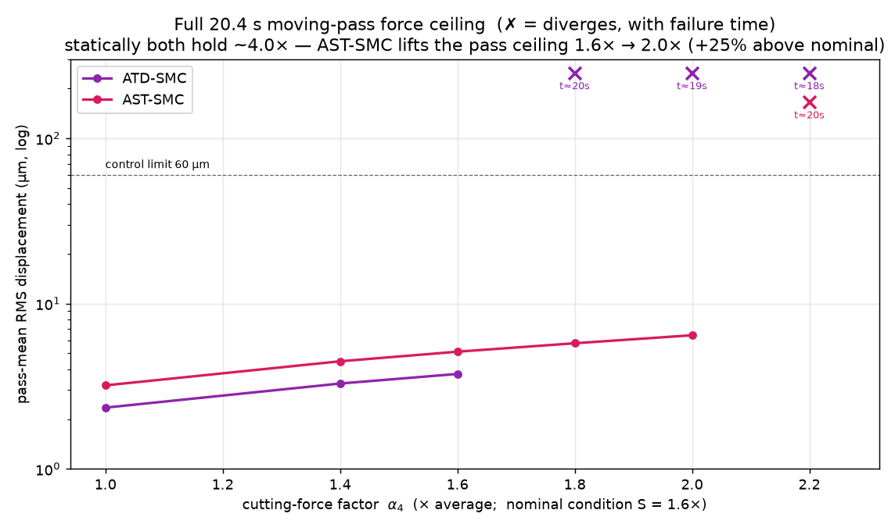
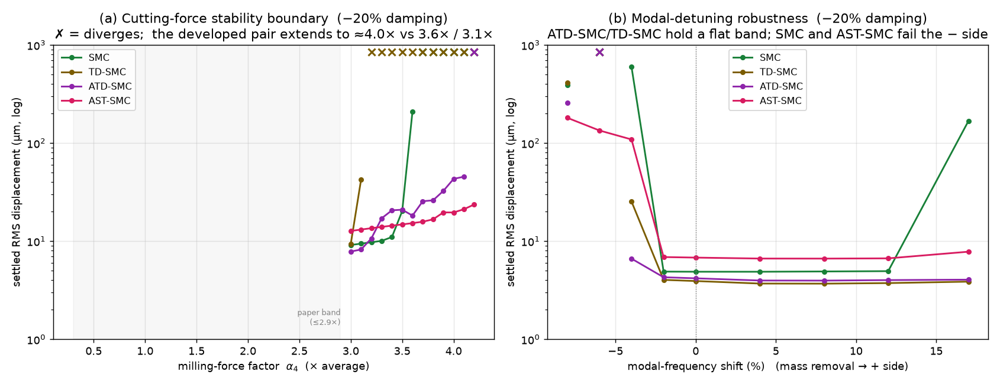

# محاكاة وتطوير عائلة متحكمات الانزلاق (Sliding-Mode) للتحكم الفعّال في اهتزاز لوح مرن أثناء الخراطة (Milling)

**Active vibration control of a thin‑walled cantilever plate during milling —
developing the sliding‑mode family SMC → TD‑SMC → {ATD‑SMC, AST‑SMC}: an honest
Pareto pair that extends the control envelope on complementary axes.**

مقارنة كمّية وتطوير منهجي **لعائلة الانزلاق** على نفس المنشأة (اللوح) ونفس المشغّل
البيزوكهربائي ونفس معدّل الأخذ، لقمع **الثرثرة التجديدية (regenerative chatter)** في
خراطة لوح رقيق منحصر، بناءً على النموذج الفيزيائي للورقة البحثية:

> J. Du, X. Liu, H. Dai, X. Long, *"Robust combined time delay control for
> milling chatter suppression of flexible workpieces"*, International Journal of
> Mechanical Sciences **274** (2024) 109257.
> https://doi.org/10.1016/j.ijmecsci.2024.109257

مسار التطوير (أربعة متحكمات):

| # | المتحكم | الفكرة | الدور | جديد؟ |
|---|---------|--------|------|:---:|
| 1 | **SMC** | سطح انزلاق **حالة** (صيغة نظامية) + مراقب Kalman + حدّ تبديلي ثابت (PSO) | القاعدة | قاعدة |
| 2 | **TD‑SMC** | SMC + حدّ تأخير زمني `K_Pp·y(t−τ)+K_Pd·ẏ(t−τ)` (فكرة معادلة 30) | المرجع المُدمَج المعروف | **لا** |
| 3 | **ATD‑SMC** ⭐ | TD‑SMC + **كسب تبديلي مُتكيِّف** (يقدَح بـ\|s\|، قابل للعكس) + بدء ليّن | **بطل الساكن والاقتصاد** (8/11) | تطوير هندسي |
| 4 | **AST‑SMC** ⭐ | **Super‑Twisting** (حدّ تكاملي مستمرّ) + تغذية أمامية تجديدية نموذجية **مُجدوَلة بالسعة** | **بطل المِظروف المتحرّك** (سقف المرور 2.0×) | تطوير هندسي |

> **صدق علميّ — لا ادّعاء بالجِدّة:** لا شيء من هذه القوانين جديد بذاته — الانزلاق
> الحالة، تعويض التأخير، الكسب المُتكيِّف، Super‑Twisting، وتعويض القوة المتأخّرة كلّها
> مفاهيم **مُؤسَّسة**. المساهمة **هندسية وتحليلية**: تركيبها ومعايرتها للمسألة اللاسلسة
> اللاطورية (non‑minimum‑phase) للخراطة، وقياس أيّ آلية تُغلق أيّ فجوة (مع **سجلّ
> إزالاتٍ** للآليات المدحوضة)، وتوصيف الحدود الفيزيائية بأمانة.

> **نموذج الفرازة = نموذج المقال حرفياً:** معاملات قوة القطع **اللاسلسة** `α₃(t), α₄(t)`
> بصيغة المقال (المعادلات 2–4: تكاملات التعشيق لكل سنّ مع الحلزون) — `src/cutforce.py`.

---

## 🎯 السرد: فجوتان أُغلقتا وواحدة بقيت

**الحلقة الأولى (ATD‑SMC):** الكسب التبديلي الثابت مقايضةٌ لا حلّ لها — صغيرُه يعجز عن
القوى المتطرّفة وكبيرُه يُبدّد الجهد ويُزعزع رفع التردّد. الكسب **المُتكيِّف** (ينمو
تحت الثرثرة الحقيقية فقط ويرتخي عند الهدوء) أزال المقايضة: **8/11** من جناح التحديات
بأدنى جهد اسمي (10.2V) — لكن سقفه على **المرور الكامل** بقي 1.6×.

**اكتشاف الفجوة الأهم:** ساكناً يصمد ATD‑SMC حتى `α₄=4.0×`، لكن **المرور الكامل 20.4ث
ينهار عند 1.8×** — المرور المتحرّك (عبور مناطق الاقتران الأعظمي مع انعكاس إشارة النمط
الثاني) **أصعب بنيوياً من أقسى لقطة ساكنة**. المصادقة اللقطية تُضلِّل.

**الحلقة الثانية (AST‑SMC) — إغلاق الفجوة:** بعد دحض آليتين (انظر سجلّ الإزالات)،
أغلقت القاعدةُ **Super‑Twisting** الفجوة: حدُّها التكامليّ المستمرّ يوفّر رفضَ اضطرابٍ
متواصلاً يصمد عبر الاقتران المتغيّر — **سقف المرور ارتفع من 1.6× إلى 2.0× (+25%)**،
والتغذية الأمامية المُجدوَلة أغلقت معه **الحالة المركّبة نظيفاً** (20.8µm/76V حيث الجميع
يتباعد أو يتشبّع).

**🗂️ سجلّ الإزالات (نتائج سلبية مُبرهَنة، كلٌّ بآليتها):**
1. **جدولة كسبٍ بمسار الأداة** — أسوأ اسمياً (+9% RMS، +24% جهد) ولا تُنقذ شيئاً: فصلُ
   مقاييس زمنية بأربع مراتب (تكيُّفٌ بالميلي‑ثانية مقابل تغيّرٍ بعشرات الثواني) + فشلٌ
   **غير مُتطابِق** لا يبلغه أيّ كسب تبديلي.
2. **إلغاء الاضطراب بمراقب ESO/DOB** — اقتصاد اسمي مبهر (3µm/7V) لكن محور القوة ينهار
   حتى والكسبُ في سقفه: المُقدِّر يفترض اضطراباً بطيئاً فيُلغي مركّبة الثرثرة ~1.1kHz
   **بطورٍ متأخّر**، وإلغاءٌ خاطئ الطور لتغذية راجعة موجبة مؤخَّرة **يضخّ طاقة**. بنيويّ.
3. **اتجاه تغذية أمامية مُتتبِّع للمسار** — نتائج مطابقة حرفياً للاتجاه الساكن على كل
   المرورات: معرفة المسار **زائدة** في الدورين المُختبَرين لهذا الصنف من التغيّر البطيء.
4. **بدء ليّن على AST‑SMC** — لا يُصلح تشبّعه الدائم في tightV ويكسر +17% (يترك الاهتزاز
   يتراكم فتنفلت الجدولة عند تردّد مُزاح). رُفض.

**الفجوة الباقية (مفتوحة بصدق):** حافة الانزياح السالب −8% تُجهد الجميع (≥180µm)، وAST
أعمى عند −4% أصلاً (انظر أدناه). الاتجاه الفيزيائي لإزالة المادة موجبٌ، فالحافة السالبة
تمثّل خطأ نمذجة/حرارة — تُوثَّق حدّاً مفتوحاً.

---

## 🚀 التشغيل السريع

```bash
pip install -r requirements.txt
python run_comparison.py          # المقارنة الرباعية (اسمي + أسوأ حالة) + الأشكال
python make_challenge_figure.py   # جناح التحديات الـ11 الأصعب من الورقة (الشكل المِحوري)
python make_boundary_figure.py    # حدّا القوة والانزياح (اجتياحان ساكنان)
python make_pass_ceiling_figure.py # سقف المرور الكامل (الشكل الحاسم؛ ~25 دقيقة)
python full_pass.py               # المرور الكامل 20.4ث للأربعة
```

---

## 🔬 المسألة الفيزيائية

خراطة الألواح الرقيقة تُثير **ثرثرة تجديدية**: سُمك الرقاقة الحالي يعتمد على المسار
السابق للسن ⟹ تأخير `τ` (دور مرور الأسنان) في قوة القطع يُحوّل الأنماطَ ضعيفة الإخماد
إلى غير مستقرّة. النموذج (معادلة 12 بالورقة، `N` أنماط، `M=I`):

```
q̈ + C q̇ + K q + α₄(t)·Φ_mill Φ_millᵀ·[q(t) − q(t−τ)] = fτ·α₃(t)·Φ_mill + Hpe·u(t)
y(t) = Φ_sensorᵀ q(t)
```

- `Φ_mill(x_T)` عند **نقطة القطع المتحرّكة** (إشارة النمط 2 **تنعكس** عبر المرور)،
  `Φ_sensor` علوي‑يمين، `Hpe` (بيزو) سفلي‑يسار — **non‑collocated**
- **⚠️ non‑minimum‑phase:** النمط الالتوائي بإشارتين متعاكستين عند المشغّل (−4.62)
  والحسّاس (+6.1) ⟹ صفر يمنى ~5175 Hz يحدّ تغذية المخرج — لذا كانت تغذية الحالة
  الانزلاقية أقوى قاعدة.
- المرور الكامل: تغذية 4.9مم/ث، 20.4ث، إزالة المادة ترفع الترددات تدريجياً.
- بدون تحكّم: ثرثرة نمط ثانٍ ≈1126 Hz (المقال: 1135) تتباعد خلال ~0.2ث.

### المعاملات (من الورقة)

| البند | القيمة |
|------|--------|
| اللوح | AL6061، ‏100×80×4 مم |
| الترددات/الإخماد | 540/1068/2787 Hz؛ 0.31/0.17/0.27% |
| الأداة/الشرط S | 3 أسنان Ø10مم؛ 4900rpm، 0.3مم، 0.02مم/سن |
| `f_t` / `τ` | 245 Hz / 4.08 ms |
| المشغّل/الحسّاس | بيزو d₃₁=175pm/V سفلي‑يسار / إزاحة علوي‑يمين؛ `u_max=150V` |

---

## 📊 النتائج

### 1) اللقطة الاسمية وأسوأ حالة الورقة (من `run_comparison.py`)

| المتحكم | RMS اسمي (µm) | ذروة‑V | طاقة (V²·s) | أسوأ `α₄=2.9` (−20% إخماد) |
|---------|:---:|:---:|:---:|:---:|
| SMC | 4.86 | 13.5 | 8.19 | 8.80µm |
| TD‑SMC | **3.91** | 11.4 | **3.85** | **7.27µm** |
| **ATD‑SMC** ⭐ | 4.17 | **10.2** | 3.92 | 7.58µm |
| **AST‑SMC** | 6.76 | 19.0 | 24.8 | 12.20µm |

> ATD‑SMC يُطابق اقتصاد TD‑SMC (أدنى ذروة 10.2V) مع متانة أوسع بكثير؛ AST‑SMC يدفع
> جهداً أعلى اسمياً — ثمن مِظروفه المتحرّك.

### 2) جناح التحديات الـ11 الأصعب من الورقة (من `make_challenge_figure.py`)

RMS مستقرّة (µm) / ذروة V. **DIV**=يتباعد؛ العتبة: RMS<60µm وبلا تشبّع دائم.

| التحدّي | SMC | TD‑SMC | ATD‑SMC | AST‑SMC |
|--------|:---:|:---:|:---:|:---:|
| اسمي | 4.9/14 | 3.9/11 | 4.2/10 | 6.8/19 |
| `α₄=0.3×` | 0.9/12 | 0.7/5 | 0.8/2 | 1.3/18 |
| `α₄=2.9×` (أقصى الورقة) | 8.8/23 | 7.2/24 | 7.6/20 | 12.3/29 |
| **`α₄=3.5×`** | 20.2/83 | ❌ DIV | ✅ 20.9/97 | ✅ **14.8/42** |
| `α₄=4.5×` / `5.5×`¹ | ❌ | ❌ | ❌ | ❌ |
| رفع تردّد +12% | 4.9/16 | 3.7/16 | 4.0/10 | 6.7/24 |
| **رفع تردّد +17%** | ❌ 167/تشبّع | 3.9/21 | ✅ **4.0/10** | ✅ 7.8/30 |
| **انزياح −4%** (جديد²) | ❌ 426 | ✅ 5.3 | ✅ **4.3** | ❌ 109/تشبّع |
| **حدّ 20V** | ❌ تشبّع | ❌ تشبّع | ✅ **7.6/19.5** | ❌ تشبّع |
| **مركّبة** (`4.0×`+إخماد−40%) | ❌ DIV | ❌ DIV | ⚠️ 45/150 (مقيَّد على الحدّ) | ✅ **20.8/76 نظيفة** |
| **الصامدون** | **5/11** | **6/11** | **8/11** ⭐ | **7/11** |

¹ فوق سلطة البيزو الفيزيائية — تُسقِط الجميع (سقف فيزيائي لا خوارزمي). ² أُضيف بعد
اكتشاف نقطة عمى AST: الجناح الأصلي لم يحوِ انزياحاً سالباً — سُدَّت ثغرة الجناح نفسه.

### 3) الشكل الحاسم: سقف المرور الكامل 20.4ث (من `make_pass_ceiling_figure.py`)

| `α₄` على المرور الكامل | ATD‑SMC | AST‑SMC |
|:---:|:---:|:---:|
| اسمي (1.0×) | ✅ **3.71µm / 9.6V** | ✅ 5.11µm / 21.7V |
| 1.6× | ✅ 3.75µm | ✅ |
| **1.8×** | ❌ يتباعد (t≈20.3s) | ✅ **5.75µm / 23V** |
| **2.0×** | ❌ | ✅ **6.43µm / 39V** |
| 2.2× / 2.5× | ❌ | ❌ (t≈20.0/19.5s) |

**السقف: 1.6× ← 2.0× (+25%)** — والإسناد أمين: التغذية الأمامية بقيت خاملة ($g=0$)
على المرورات الناجية، والاتجاه المُتتبِّع طابق الساكن — **الفضل لحدّ Super‑Twisting
التكاملي**. لاحظ الفجوة البنيوية: ساكناً كلاهما ~4.0×، متحرّكاً 1.6–2.0× فقط.

### الأشكال (في `results/`)

| الشكل | الوصف |
|-------|-------|
| **`fig_challenges.png`** | الجناح الـ11 × 4 متحكمات (الشكل المِحوري الساكن) |
| **`fig_pass_ceiling.png`** | **سقف المرور الكامل** (الشكل الحاسم المكاني‑الزماني) |
| **`fig_boundary_detuning.png`** | (أ) حدّ القوة الساكن (ب) نطاق الانزياح |
| `fig_time_response/spectrum/metrics_bars/robustness/activation/control_voltage/time_full` | لقطة اسمية |
| `fig14_responses.png`, `fig_full_pass.png` | المرور الكامل بنمط الشكل 14 |





---

## 📁 بنية المشروع

```
├── run_comparison.py            # المقارنة الرباعية + الأشكال والجداول
├── make_challenge_figure.py     # جناح التحديات الـ11 (الشكل المِحوري)
├── make_boundary_figure.py      # حدّا القوة والانزياح
├── make_pass_ceiling_figure.py  # سقف المرور الكامل (الحاسم)
├── full_pass.py                 # المرور الكامل 20.4ث
├── src/
│   ├── config.py  cutforce.py  plant.py  simulate.py  design.py  metrics.py
│   ├── challenges.py            # الجناح الـ11 + معيار الصمود
│   ├── tuning_pso.py            # مُحسِّن PSO
│   └── controllers/
│       ├── base.py  smc.py      # القاعدة
│       ├── tdsmc.py             # المرجع المُدمَج (غير جديد)
│       ├── atdsmc.py            # المطوَّر #1: كسب مُتكيِّف (بطل الساكن 8/11)
│       └── astsmc.py            # المطوَّر #2: Super-Twisting + تغذية مُجدوَلة (سقف المرور 2.0×)
├── docs/report.md               # التقرير التقني المفصّل
└── results/                     # الأشكال + metrics.csv/json
```

> متحكمات المراحل السابقة (PID، H∞، µ، ADRC، MPC، RCTDC) باقية في `src/controllers/`
> خارج المقارنة الحالية.

---

## ⚠️ ملاحظات على النمذجة والصدق

- **زوج باريتو لا بطل واحد:** ATD‑SMC (ساكن/اقتصاد/انزياح) وAST‑SMC (مِظروف متحرّك/
  حالة مركّبة) — كلٌّ يفشل حيث ينجح الآخر، والفشل مُوثَّق رقمياً لا مُخفى.
- **نقطة عمى AST‑SMC:** عند انزياح −4% يقرأ مُجدوِلُ السعة عدمَ التطابق قوةً فيُنفلت
  ($g\to8$) ويتشبّع (109µm) — بينما ATD يثبت عند 4.3µm. الاتجاه الفيزيائي (+) آمن.
- **السقف `α₄≥4.5×` فيزيائي** (سلطة البيزو) والفجوة الساكنة/المتحرّكة (4.0 مقابل
  1.6–2.0) **بنيوية** — توثيقهما جزء من المساهمة.
- النموذج مُعاير لإعادة إنتاج **الظاهرة** (ثرثرة نمط 2 عند ~1.1kHz) بمُعامِلَي معايرة
  موثَّقَين؛ ليست إعادة إنتاج بالبكسل.

للتفاصيل: **[docs/report.md](docs/report.md)**.
