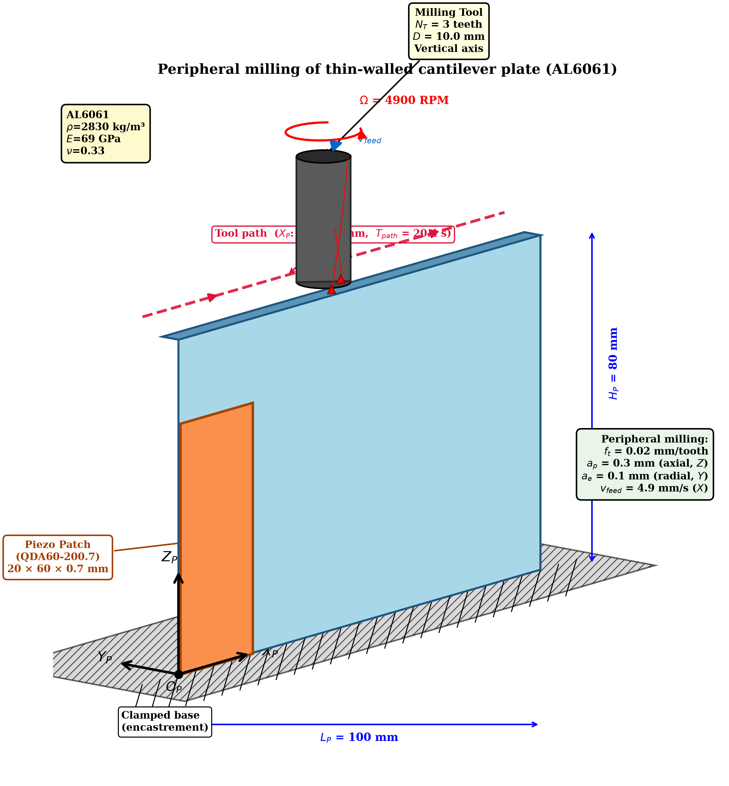

# Setup geometry — diagram ↔ Mindlin model correspondence

This document maps the article **setup diagram** to the Reissner–Mindlin
`PlateModel`, and records that the model reproduces it exactly (verified by
[`../tests/verify_geometry.py`](../tests/verify_geometry.py)).



*(3D isometric generated by `04_figures/gen_geometry_figure.py`; front and top
views are in `geometry_front.png` / `geometry_top.png`.)*

## Coordinate frame `O_P – X_P Y_P Z_P`

| Diagram axis | Meaning | In the model |
|---|---|---|
| **X_P** | horizontal, along the plate length `L_P = 100 mm` | mesh axis 1, `lp`, `lex = lp/N1` |
| **Z_P** | vertical, along the plate height `H_P = 80 mm` | mesh axis 2, `hp`, `ley = hp/N2` |
| **Y_P** | out-of-plane, plate thickness `B_P = 4 mm` | direction of the transverse deflection `w` |
| `O_P` | origin at the bottom-left of the plate | grid node `(ix=0, iy=0)` |

The plate lives in the **`(X_P, Z_P)` plane**; the transverse deflection `w`
(the plate's bending DOF) is along **`Y_P`**. Each Mindlin node carries
`(w, θx, θy)`, where `θx, θy` are the section rotations about the in-plane axes.
Public API arguments use the diagram's `(x, z)` naming: `add_piezo_patch(xP1,
xP2, zP1, zP2, …)`, `set_observation(x_obs, z_obs)`, `precompute_Dp(zp_pos)`.

## Element-by-element correspondence

| Diagram element | Model realisation | Verified |
|---|---|---|
| **Clamped base** (encastrement, hatched) at `Z_P = 0` | `clamped_edge_dofs(node_id, "bottom")` fixes `w = θx = θy = 0` on the whole bottom edge (183 DOFs = 3 × 61 nodes) | ✔ test 2 |
| **Vertical cantilever plate** `L_P×H_P×B_P` | `PlateModel(lp=0.1, hp=0.08, bp=0.004, …)`; mode 1 = 519 Hz, `w=0` at base → max at free top | ✔ tests 1, 3 |
| **Piezo patch** corners `(x_P1,z_P1)`–`(x_P2,z_P2)` | `add_piezo_patch(xP1=0, xP2=0.020, zP1=0, zP2=0.060, …)` — lower-left to upper-right, `20×60×0.7 mm` (QDA60-200.7) | ✔ test 4 |
| **Displacement sensor** (out-of-plane `w`) | `set_observation(x_obs=0.1, z_obs=0.08)` → modal row `D_obs`; Newmark reads `y = D_obs·q` | ✔ test 5 |
| **Control system** | `controller.step(x_hat, u_prev, y)` (LQG / DARC-MPC) in `newmark_solver.py` | — |
| **Piezoelectric actuator** | `H_Pe_modal · u` bending-moment coupling on the patch | ✔ test 4 |
| **Milling tool**, vertical axis, feed along `X_P` | tool path `X_P: 0 → L_P` at fixed `Z_P = H_P − a_p/2` (near top); force via `alpha3/alpha4·Dp` | ✔ test 6 |

## Control loop (diagram right-hand chain)

```
 plate deflection w(x_obs, z_obs)                     ┌─────────────────────┐
        │  (out-of-plane, Y_P)                        │  Displacement sensor │
        ▼                                             └──────────┬──────────┘
   y = D_obs · q  ──────────────────────────────────────────────▼
                                                      ┌─────────────────────┐
                                                      │   Control system    │  LQG / DARC-MPC
                                                      └──────────┬──────────┘
                                                                 ▼   u (volts)
   F_piezo = H_Pe_modal · u  ◄─────────────────────── ┌─────────────────────┐
   (bending moment on patch)                          │ Piezoelectric actuator │
                                                      └─────────────────────┘
```

This is exactly the sensor → control system → piezoelectric actuator loop of
the diagram, implemented in `05_main/main_simulation.py` + `01_core/newmark_solver.py`.

## Reproduce

```bash
# geometry figures (this diagram)
cd 04_figures && MPLBACKEND=Agg python gen_geometry_figure.py

# geometry conformance of the Mindlin model
cd ../tests && python verify_geometry.py
```
