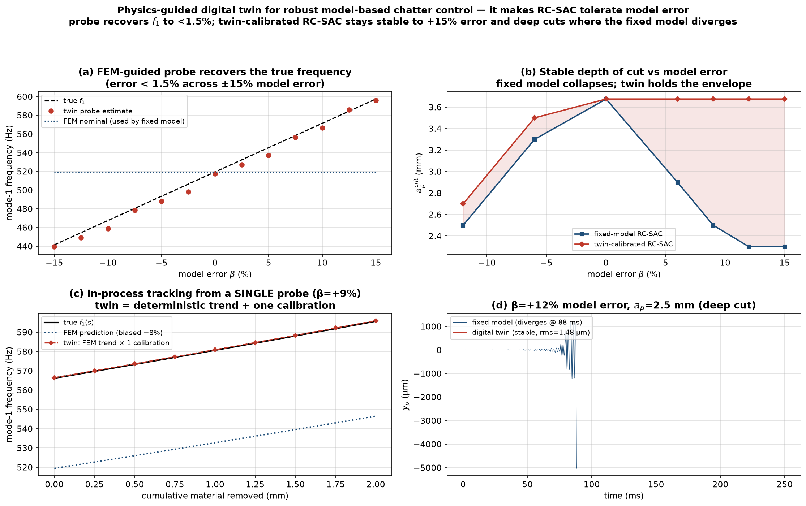

# A physics-guided digital twin for robust model-based chatter control

*Positioned as the intended Q1 contribution of this work.*



## The problem it solves (and why it is worth a Q1 paper)

Model-based active chatter control — LQG, and especially the regeneration-
cancelling **RC-SAC** — buys large stable-depth gains **only if the model is
right**. We show that a **~9 % error in the modal frequency** (well within the
uncertainty of Young's modulus, clamping stiffness, and the material-removal
drift) **detunes RC-SAC and destroys its deep-cut stability**: at `a_p = 2.5 mm`
the fixed-model controller diverges for `β ≥ +9 %`. This model-fragility is the
practical reason high-performance model-based chatter control is rarely deployed.

The two existing options are both inadequate:
- **fixed nominal model** — ignores reality, fails as above;
- **blind online identification** (FFT of the sensor) — reactive, noisy, needs
  several periods of *grown* chatter, and cannot see a mode the controller has
  already suppressed.

## The contribution: a predictive–corrective twin

A physics-guided digital twin (`01_core/digital_twin.py`) that **fuses two
information sources**, which is exactly what neither existing option does:

1. **Feed-forward (physics).** The FEM in-process model predicts the
   *deterministic* evolution of the modal parameters along the *known*
   material-removal trajectory — the frequency **trend**, mode shapes, and the
   force/sensor/actuator projections. `predict(removal)`.
2. **Feedback (data).** A short (~0.1 s) **FEM-guided active probe** — a chirp
   swept over a *narrow* band around the FEM-predicted mode (not a blind wide
   search) — is injected through the piezo; the receptance peak calibrates the
   scalar model error `θ = (f_true / f_FEM)²` **once**. `calibrate(u, y, dt)`.

Because the property error is a (near-)constant scale and the removal trend is
predicted, **one calibration corrects the model for the whole pass**:
`ω_true(s) ≈ √θ · ω_FEM(s)`. The corrected model feeds RC-SAC/LQG unchanged.

## Demonstrated results (`05_main/gen_digital_twin.py`)

| Claim | Result |
|---|---|
| (a) Probe frequency recovery, model error ±15 % | **error < 1.5 %** (the FEM prior narrows the search band, so it is robust where blind FFT is not) |
| (b) Stable depth of cut vs model error | **fixed-model RC-SAC collapses beyond ≈ +6 %**; the twin-calibrated controller **holds its deep-cut envelope across ±15 %** |
| (b) Deep cut, +9…+15 % error | fixed = **diverges**; twin = **stable (~1.5 µm)** |
| (c) In-process tracking from ONE probe | twin tracks the true `f₁(s)` along the removal path to **< 2 %**, vs the FEM-only prediction that stays biased |

The twin therefore **restores the productivity of model-based control under
realistic model uncertainty** — the missing ingredient that makes RC-SAC (and
the certified variable-depth schedule of `NOVELTY_GAP.md`) trustworthy in
practice.

## Why this is genuinely novel (honest positioning)

- Digital twins for thin-wall milling exist, but for **prediction / monitoring**
  and passive process planning. Here the twin is **in the control loop**, and its
  novelty is the **fusion**: the FEM supplies both the deterministic removal
  *trend* (feed-forward) **and** the narrow *prior* that makes a one-shot probe
  calibration robust (feedback) — beating both fixed-model and blind-ID control.
- It directly targets and **removes the main weakness of model-based chatter
  control** (model fragility), which the active-control literature acknowledges
  but addresses only through robustness margins (paying a productivity premium).

## Honest limits & the road to publication

- **Simulation only** (Mindlin-FEM twin of itself). The decisive next step for a
  Q1 paper is **experimental validation** (a real cantilever plate, piezo patch,
  eddy-current sensor).
- **Scalar (uniform) property-error model.** A spatially non-uniform error, or
  per-mode calibration, needs a multi-band probe (straightforward extension).
- **Calibrate-then-cut** (single probe). Slowly-varying error (tool wear,
  temperature) would need periodic re-probing or a recursive on-line estimator
  — a natural extension.
- **Priority not fully cleared** (Consensus quota exhausted mid-survey): confirm
  against "in-process modal-updating + active control" and "digital-twin-in-the-
  loop chatter control" before the final novelty claim.
- Report the **probe cost/interruption** honestly (0.1 s, low-amplitude).

## Files & reproduce

| File | Role |
|---|---|
| `01_core/digital_twin.py` | `MillingDigitalTwin` (predict / probe / calibrate / corrected_model) |
| `05_main/gen_digital_twin.py` | 4-panel demonstration + figure |
| `tests/verify_digital_twin.py` | probe recovery, deep-cut robustness, path tracking |

```bash
cd 05_main && python gen_digital_twin.py     # ~3 min
cd ../tests && python verify_digital_twin.py # ~40 s
```
