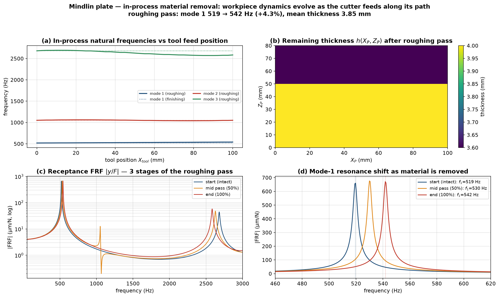

# In-process material removal — time-varying workpiece dynamics

As the cutter feeds along its path it removes material, so the plate's mass and
stiffness — and therefore its natural frequencies, mode shapes and the modal
projections seen by the force / sensor / piezo — change **during** the cut. This
is the *in-process workpiece dynamics* effect, important for thin-wall milling.
It is added by `01_core/inprocess_plate.py` (`InProcessPlate`, a subclass of the
Mindlin `PlateModel`).



## What was added

| Piece | Role |
|---|---|
| per-element thickness `h_elem[I,J]` | the assembly (`_assemble`) builds `Kg, Mg` from a thickness **field** instead of one `bp`; elements are cached by thickness value |
| `new_pass()` / `machine_to(x_tool, a_p, a_e)` | removes the material the cutter has swept up to feed position `x_tool` (top axial band `a_p`, radial depth `a_e`), volume-consistently, thinning each element at most once per pass |
| `rebuild()` | re-assembles the physical matrices + re-applies the clamped BC |
| `instantaneous_modes(n)` | exact natural frequencies / shapes of the current (machined) structure |
| `reduced_on_basis(V0)` | reduced matrices `M_r, K_r` on a **fixed** modal basis `V0` — a ROM whose coordinates keep their meaning while the structure changes |

With no material removed, `InProcessPlate` is byte-for-byte the same as
`PlateModel` (same 519 Hz cantilever) — verified in `tests/verify_inprocess.py`.

## Removal model

The cutter engages a band of height `a_p` at the top of the wall
(`Z_P ∈ [H_P − a_p, H_P]`) and a radial depth `a_e` through the thickness. For
each element the tool has passed, the thickness is reduced, volume-consistently,
by `dh = a_e · (overlap_height / ley)` (removed cross-section `a_e · overlap`
smeared over the element height), floored at 5 % of `bp`.

## Two reduced-order strategies

* **Exact per stage** — `instantaneous_modes()` re-solves the eigenproblem of the
  machined structure. Used for the frequency-evolution curve and the FRF at
  discrete machining stages (exact, no basis error).
* **Fixed-basis ROM** — `reduced_on_basis(V0)` projects the current physical
  matrices onto the *initial* modal basis `V0`. The reduced coordinates keep
  their physical meaning as the wall is machined, so `D_obs / H_Pe / Dp`
  (computed once from `V0`) stay valid and no state re-projection is needed —
  ideal for a time-varying Newmark integration. Mode-1 tracking error stays
  below ~0.5 % even for 1 mm of thickness removed (verified).

## Results (`05_main/gen_material_removal_sim.py`)

Article geometry, 4900 RPM. Two removal scenarios over one tool pass:

| Scenario | mode 1 | mode 3 | note |
|---|---|---|---|
| **finishing** (`a_p`=0.3, `a_e`=0.1 mm) | 519.4 → 519.5 Hz (**+0.02 %**) | −0.01 % | a light finishing pass barely changes the dynamics — physically correct |
| **roughing** (top 30 mm band, `a_e`=0.4 mm) | 519 → **542 Hz** (**+4.3 %**) | −3.6 % | removing tip material raises `f₁` (tip-mass removal) and lowers higher modes |

The mode-1 receptance peak marches **519 → 530 → 542 Hz** across start / mid /
end of the pass — the resonance the AVC controller must track shifts *during*
machining.

> **Sign of the effect.** Thinning the band **near the free tip** removes more
> inertia than stiffness there, so the cantilever fundamental frequency *rises*.
> Thinning near the clamped root would instead lower it. The model captures this
> location-dependent sensitivity automatically.

## Usage

```python
from inprocess_plate import InProcessPlate
p = InProcessPlate(0.1, 0.08, 0.004, 2830, 69e9, 0.33, N1=30, N2=24, n_modes=3)
V0 = p.V.copy()                       # fixed ROM basis (optional)
p.new_pass()
for x_tool in tool_positions:         # sweep along the path
    p.machine_to(x_tool, a_p=0.030, a_e=0.4e-3)
    p.rebuild()
    f_now, _ = p.instantaneous_modes()         # in-process frequencies
    M_r, K_r = p.reduced_on_basis(V0)          # or a fixed-basis ROM
```

Reproduce the figure:

```bash
cd 05_main && python gen_material_removal_sim.py
```
