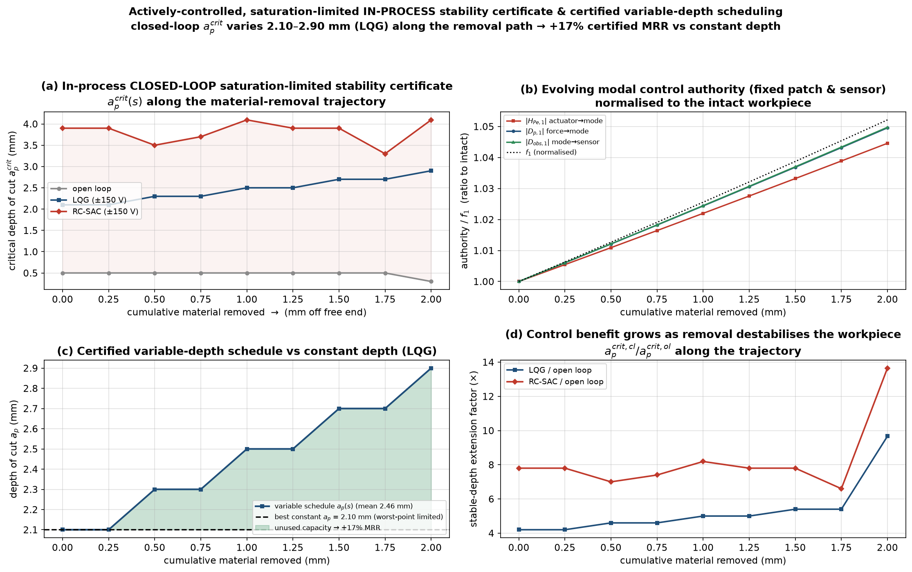

# A real research gap — and a demonstrated contribution

*Honest positioning after a literature survey (Consensus, ~80 papers + web).*

## What is already done (so we do not re-invent it)

The field is mature and crowded. Two facts forced a rethink of earlier ideas:

- **The "frequency-drift-into-a-cutting-harmonic" hazard is already known.** With a
  constant spindle speed the tooth-passing frequency (or a harmonic) can meet the
  material-removal-shifted workpiece natural frequency and destabilise the cut —
  documented in the thin-wall / blisk process-planning literature.
- **Spindle-speed scheduling to dodge that resonance is already known** (spindle
  speed variation, digital-twin process planning). So "preview the crossing and
  detune the spindle" is **not** novel.
- **In-process (material-removal) dynamics + 3-D stability lobes** are a mature
  *prediction* stream (Yang 2016; Song 2011; Wan 2018; Sun 2018; …) — but
  **open-loop / passive**.
- **Active chatter control** (LQG, H∞, μ, MPC, SMC, DVF, RL, ADRC-FOPID incl.
  the author's own 2026 paper) is mature — but designed at a **single frozen
  operating point**, treating the removal-induced drift as an *uncertainty* to
  be robust against (Du 2022/2024), or tracked by online identification.

## The gap that survives

> The in-process 3-D SLD literature is **open-loop**; the active-control
> literature is **frozen-point**. **Nobody computes the CLOSED-LOOP,
> actuator-SATURATION-limited critical depth of cut along the (deterministic,
> a-priori-known) material-removal trajectory — nor uses it to co-schedule the
> depth of cut for a certified maximum material-removal rate (MRR).**

The removal trajectory is *known offline* (toolpath + workpiece FEM), so it is
information to be *exploited by scheduling*, not uncertainty to be *paid for by
robustness*. The missing object is a **closed-loop, saturation-aware in-process
stability certificate** `a_p^{crit,cl}(s)`.

## What we demonstrate (`05_main/gen_inprocess_certificate.py`)

Along the free-end removal trajectory (mode 1: 519 → 546 Hz), with a hard
±150 V piezo limit, computed offline from the Mindlin FEM in-process model:



1. **The closed-loop, saturation-limited critical depth VARIES along the path**:
   `a_p^{crit,cl}` = **2.10 → 2.90 mm (+38 %) for LQG**, 3.3 → 4.1 mm for RC-SAC,
   while open-loop *degrades* 0.50 → 0.30 mm (removal destabilises the workpiece).
2. **Certified variable-depth scheduling** `a_p(s) = a_p^{crit,cl}(s)` yields
   **+17 % MRR (LQG) / +15 % (RC-SAC)** over the best constant depth — which is
   forced down to the worst point along the path (2.10 mm) and wastes the rest.
3. **Control benefit compounds** as removal destabilises the open loop:
   `a_p^{crit,cl}/a_p^{crit,ol}` grows **4.2 → 9.5× (LQG)** and 7.8 → 13.9×
   (RC-SAC) toward the end of the pass.
4. **Control authority is a design variable along the path.** Here the fixed
   patch/sensor authority (`|H_Pe|, |Dp|, |D_obs|`) *rises* ~5 % because free-end
   removal concentrates the mode toward the tip; for **root-thinning** removal it
   would *fall*, and where it collapses no algorithm can help with that
   actuator — a placement/scheduling driver the certificate makes explicit.

## Why this is a genuine, defensible contribution

- It is the **synthesis the two mature streams never make**: closed-loop +
  saturation + *along the removal trajectory*.
- It converts a **known-in-advance** dynamic evolution into **certified
  productivity** (variable-depth schedule) instead of a robustness cost.
- It is **actuator-honest**: the boundary is set by the real ±150 V limit, and
  the certificate exposes where control authority — not the algorithm — is the
  binding constraint.

## Honest limits (research integrity)

- **Priority not fully cleared.** The Consensus quota was exhausted mid-survey;
  a final novelty check against "adaptive depth-of-cut + active damping" is still
  pending. Treat this as a **strong candidate gap**, to be confirmed before any
  priority claim.
- **Simulation only** (Mindlin-FEM digital twin); no experimental validation yet.
- The MRR gain is scenario-dependent (free-end removal, one RPM); a full study
  should sweep RPM, removal mode (thinning vs shortening), and patch placement.
- The certificate is a **frozen-per-stage** (quasi-static) boundary; the cut is
  slow (20 s) so this is well justified, but a true time-varying (LTV) stability
  proof over the trajectory is the rigorous next step.

## Reproduce

```bash
cd 05_main && python gen_inprocess_certificate.py    # ~2–3 min
```
