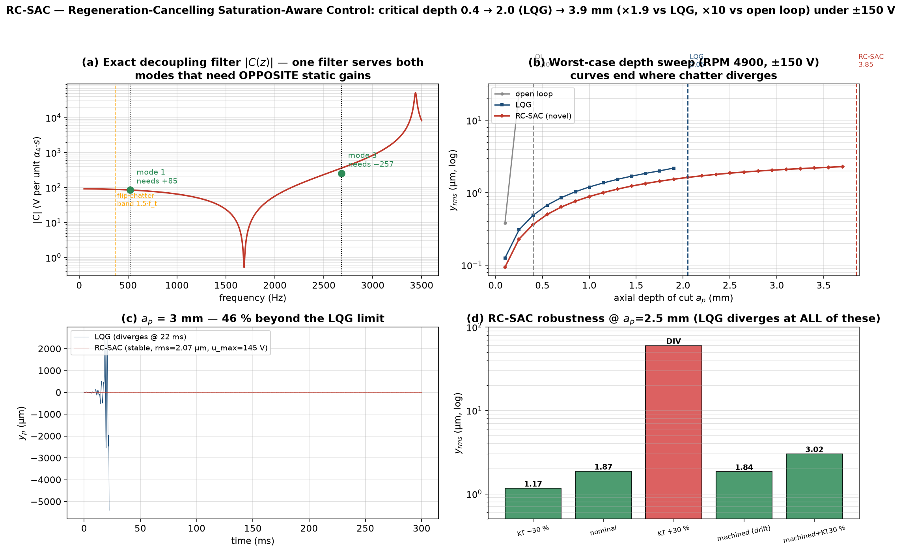

# RC-SAC — Regeneration-Cancelling Saturation-Aware Control

**The novel control strategy of this work.** Designed for the worst-case test
that defeats the LQG baseline: regenerative chatter at RPM 4900 under a hard
±150 V piezo saturation, with in-process (material-removal) frequency drift.



## Headline result (worst-case test, ±150 V)

| Controller | critical depth `a_p^crit` | vs open loop | vs LQG |
|---|---:|---:|---:|
| open loop | 0.40 mm | 1× | — |
| LQG (tuned baseline) | 2.05 mm | 5.1× | 1× |
| **RC-SAC** | **3.85 mm** | **9.6×** | **×1.9** |

RC-SAC also delivers **lower vibration than LQG at every depth** (e.g. 1.54 vs
2.19 µm at 1.9 mm) with **less voltage** in the common range, and it survives
the resonance-drift and machined-plate scenarios where LQG diverges.

## Why LQG saturates and fails

LQG fights the *energy* of the vibration (damping): its voltage demand grows
with the chatter forces, hits ±150 V at `a_p ≈ 2 mm` and the loop effectively
opens during the peaks → divergence. The root cause of the instability, however,
is not lack of damping — it is the **regenerative feedback term**

```
F_reg = α₄(t) · Dp · s(t),      s(t) = y_tool(t−τ) − y_tool(t)
```

which closes a positive-feedback loop through **one scalar channel** (the
tool-point deflection `y_tool = Dpᵀq`). Two decisive physical observations:

1. The forced (tooth-passing) response is **τ-periodic, so its delayed
   difference `s` is ≈ 0**: `s` contains only the *chatter* component. A
   controller that cancels `F_reg` therefore needs voltage proportional to the
   **suppressed** vibration level — not to the grown chatter amplitude.
2. With one actuator, static cancellation is **impossible** here: mode 1 needs
   gain `Dp₁/H₁ = +85` while mode 3 needs `Dp₃/H₃ = −257` (opposite signs!).
   This is why naive static cancellation fails at 2.5 mm with a **flip chatter
   at ≈ 1.5·f_t = 367 Hz** (period-doubling, characteristic of the highly
   interrupted cut, a_e = 0.1 mm).

## The three pillars

### P1 — Exact regeneration-channel decoupling filter `C(s)`

```
C(s) = [Dpᵀ G(s) Dp] / [Dpᵀ G(s) H_Pe],   G(s) = Σₘ eₘeₘᵀ/(s² + 2ζₘωₘs + ωₘ²)
u_ff = −C(s) · [α₄(t)·s(t)]
```

`C(s)` inverts the actuator→tool-channel dynamics **at every frequency**: it
automatically provides +85∠0° at mode 1 and 257∠180° at mode 3 — resolving the
opposite-sign conflict dynamically. Constructed symbolically from the modal
model, it is **biproper and stable** (denominator zeros ≈ 1052 Hz and 3816 Hz,
all in the LHP — the actuator/tool channel is minimum-phase), implemented as
cascaded biquads (SOS, bilinear). Voltage-efficient by shape: `C(0) ≈ 92`
(cheap where the energy is), rising to 447 only at HF where signal content is
negligible.

### P2 — Cutting-force-aware Kalman predictor

Ablation isolated the estimation bottleneck: with perfect states P1 stabilizes
4 mm (unsaturated); with the standard "blind" Kalman (cutting force = noise) it
fails at 2.5 mm. The fix: inject the **known force model** into the observer
propagation,

```
F̂(k) = f_t·α₃(k)·Dp + α₄(k)·Dp·(Dpᵀ(q̂(k−n_τ) − q̂(k)))
x̂⁺ = A_d x̂ + G_u·u_applied + G_F·F̂ + L_d·y
```

turning the observer into a predictor of the *cutting* plant (its own delayed
estimates supply the regeneration history). This pillar alone also improves
plain LQG (21.7 → 1.6 µm at 2 mm).

### P3 — Saturation-aware priority allocation

The stability-critical cancellation gets the budget first; damping uses the
rest; the observer always receives the **applied** (saturated) voltage:

```
u = clip(u_ff, ±U) + clip(u_lqg, [−U, +U] − u_ff)
```

## Verified properties & honest limits

- Nominal envelope **3.85 mm** — set by the ±150 V budget, not the algorithm.
- Robust @2.5 mm to: K_T −30 %, machined plate (drift 519→533 Hz), machined +
  K_T +30 % (all stable; LQG diverges in *all* of these). K_T +30 % on the
  *intact* plate at 2.5 mm (effective depth 3.25 mm, at the saturated edge of
  the envelope) diverges → the **robust** envelope under ±30 % force
  uncertainty is ≈ 3.85/1.3 ≈ **2.9 mm**, still ×1.4 the *nominal* LQG limit.
- Model-based: needs the modal model (Dp, H, ω, ζ), the force law (α₃, α₄, τ)
  and spindle sync. On-line adaptation of an α₄ scale factor is the natural
  extension (future work; the in-process drift case is already covered).
- The moving-tool extension replaces the fixed `Dp` by the `plate.Dp_array`
  lookup, and the machined-state update by the `InProcessPlate` ROM.

## Files

| File | Role |
|---|---|
| `02_controllers/rcsac_controller.py` | the RC-SAC controller class |
| `05_main/gen_rcsac_strategy.py` | worst-case evaluation + this figure |
| `tests/verify_rcsac.py` | filter properties + stability + robustness checks |

## Reproduce

```bash
cd 05_main && python gen_rcsac_strategy.py     # ~40 s
cd ../tests && python verify_rcsac.py          # ~30 s
```
